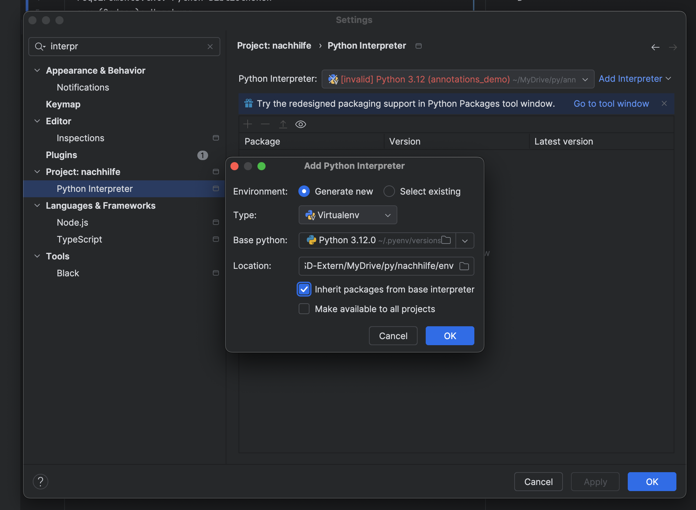
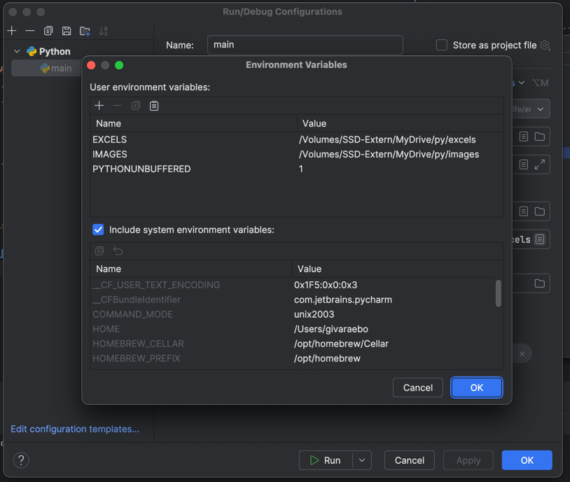

# Python

## Python Konfigurationen
- requirements.txt: Python Bibliotheken 
  - `pip install -r requirements.txt` installiert alle Bibliotheken
- env (Ordner): Umgebung

## Environment Setup in PyCharm
1. File -> Settings -> Project -> Python Interpreter
2. (Existing Environment) Add Python Interpreter -> Select existing 
   - type: Virtualenv
   - Base Python: [path_to_interpreter]/env/python.exe
   - Location: [your_path]/env
3. (New Environment) Add Python Interpreter -> Generate new
   - type: Virtualenv
   - Base Python: [path_to_interpreter]/env/python.exe
   - Location: [your_path]/env
5. Apply -> OK

## Python Environment Variablen/Parameter
- Umgebungsvariablen sind Variablen/Parameter die in der Umgebung des Programms gespeichert sind, um z.B. Konfigurationen zu speichern, sensible Daten zu verstecken oder um die Wiederverwendbarkeit zu erhöhen.
- `os.environ.get('KEY')` gibt den Wert der Umgebungsvariable 'KEY' zurück

